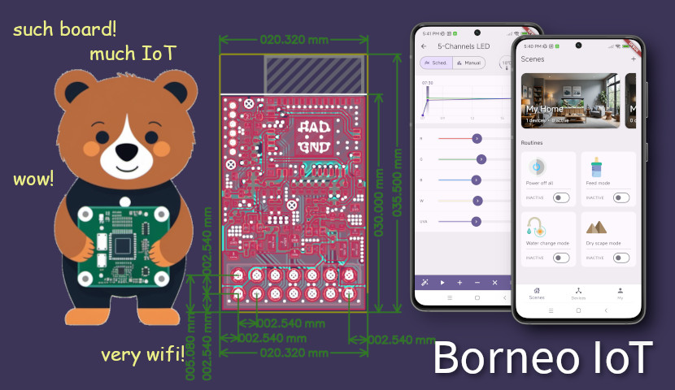

# Welcome!



Welcome to the online documentation of Borneo-IoT Project!

Borneo-IoT project is a commercial-grade, highly customizable open-source smart WiFi aquarium LED PWM controller and mobile App. More than that, the Borneo IoT project also includes a 63W 5-color channel LED product as reference design.

---

::::{grid} 1 2 2 3
:gutter: 1 1 1 2

:::{grid-item-card} {octicon}`tools;1.5em;sd-mr-1` Getting Started
Interested? Please follow the documentation below to learn how to DIY your own WiFi aquarium LED like a pro.
+++
[Learn more »](getting-started)
:::

:::{grid-item-card} {octicon}`book;1.5em;sd-mr-1` Hardware Datasheets
The hardware specifications in PDF format.
+++
[View/download »](https://github.com/borneo-iot/borneo/tree/master/hw/datasheets)
:::

:::{grid-item-card} {octicon}`device-mobile;1.5em;sd-mr-1` Mobile App
This project comes with an open source cross-platform App to control the devices.
+++
[Learn more »](mobile-app)
:::

::::

---

:::{note}
This document is currently a work in progress.
:::

# Copyright

This document is Copyright © by Yunnan BinaryStars Technologies, Co., Ltd. You may distribute it and/or modify it under the terms of the GNU General Public License, version 3 or later (GPLv3+).

All trademarks within this guide belong to their legitimate owners.

# Contents

```{toctree}
:maxdepth: 3

introduction
getting-started/index
user-guides/index
mobile-app/index
hardwares/index
protocol/index
borneopy/index
faq
licensing
```


# Indices and Tables

```{toctree}
:maxdepth: 1

glossary
```
