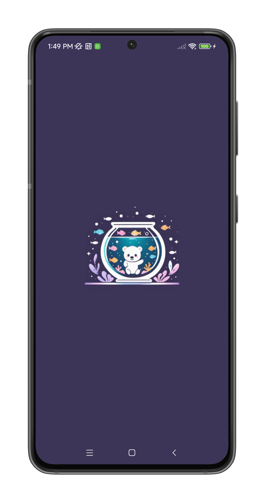
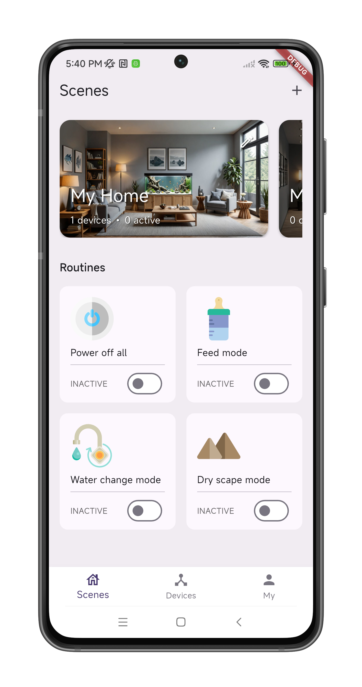
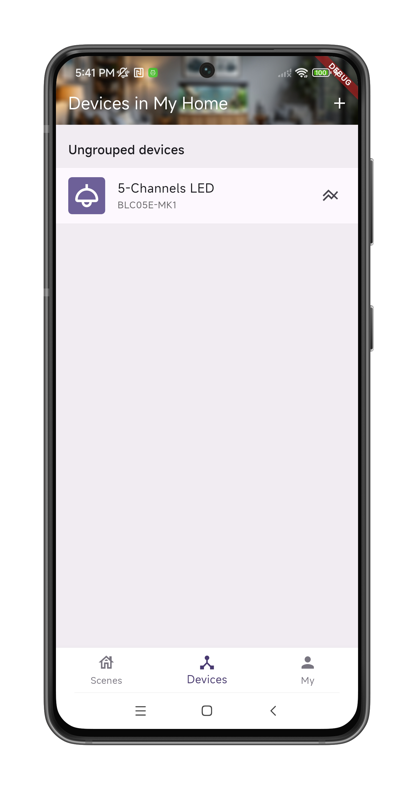
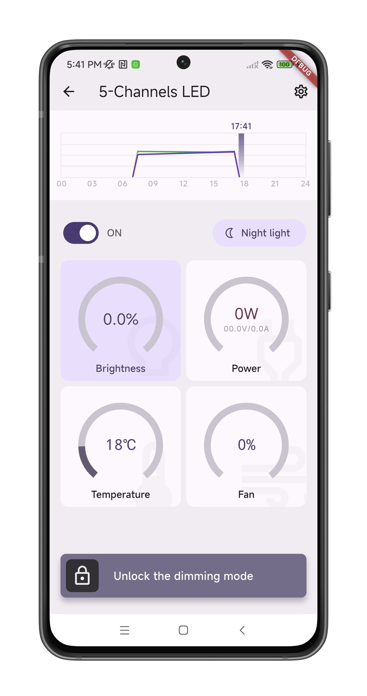
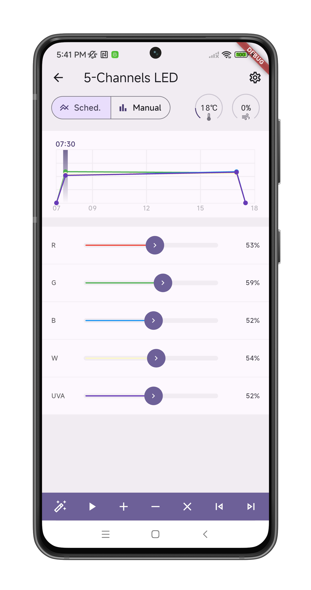
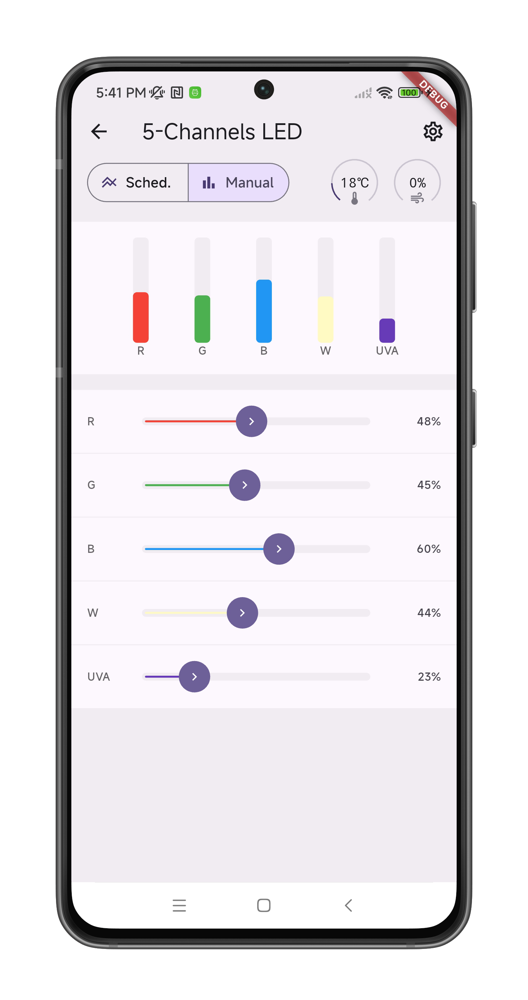
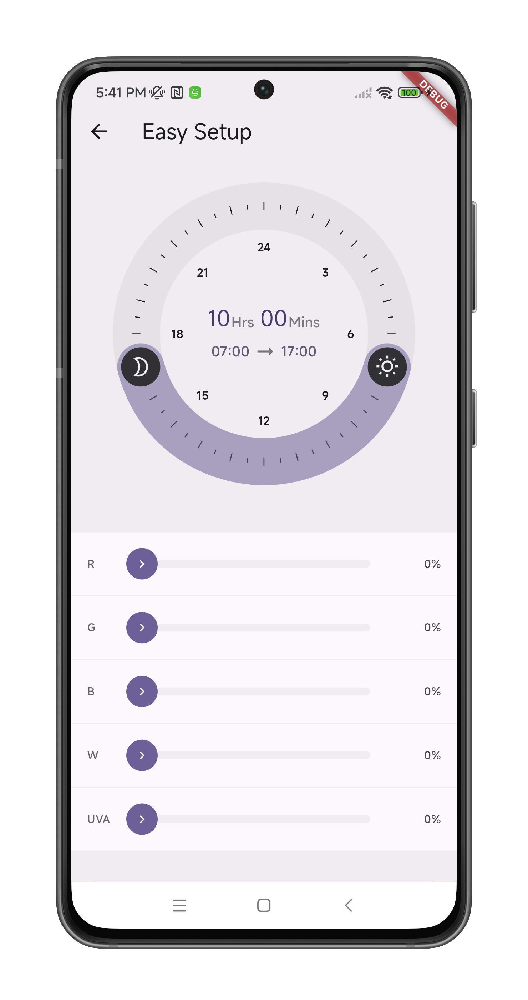
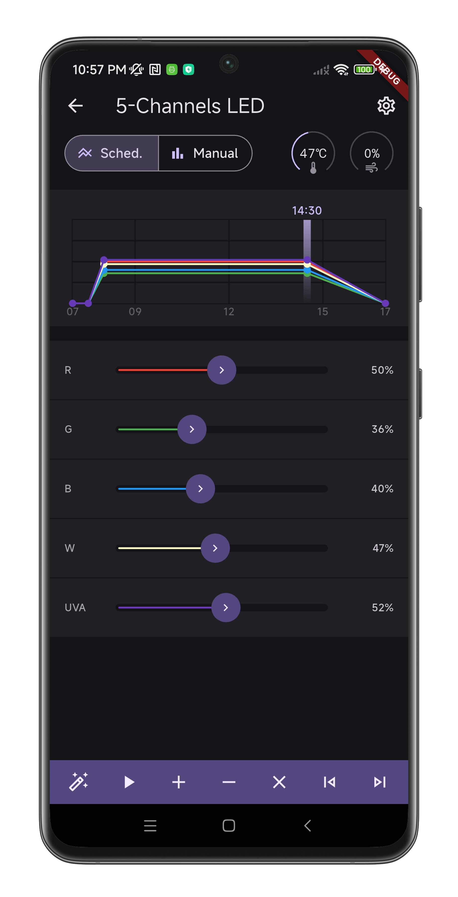

(mobile-app)=
# Mobile App

## Features

* Cross-platform app developed in Flutter, supports: Android/iOS/Windows/Linux/MacOS[^ios-macos]
* Scene management, allowing switching between different locations to control different devices
* Devices grouping
* ESPTouch protocol based WiFi provisioning
* Automated device discovery using mDNS/Zeroconf
* Smart LED control functions:
    - Multi-segment dimming for sunrise and sunset simulation
    - Manual control mode
    - Quick preview of multi-segment dimming
    - Easy setup
* Dark theme
* Multi-language support
* And more

:::{note}
The AppStore/PlayStore and APK downloads are not available yet, you need to compile and run from the source code.
:::

[^ios-macos]: I do not own any Apple devices, so iOS and MacOS support is in theory and untested.

## Videos

* A short demo on [YouTube](https://youtube.com/shorts/Z78nOzLQvq0).

## Screenshots

::::{grid} 1 2 2 4
:gutter: 1 1 1 3

:::{grid-item-card} Splashing Screen
{w=200px}
:::

:::{grid-item-card} Scenes & Routines
{w=200px}
:::

:::{grid-item-card} Devices Management
{w=200px}
:::

:::{grid-item-card} LED Dashboard
{w=200px}
:::

:::{grid-item-card} LED Scheduled Mode
{w=200px}
:::

:::{grid-item-card} LED Manual Mode
{w=200px}
:::

:::{grid-item-card} LED Easy Setup
{w=200px}
:::

:::{grid-item-card} Dark Theme
{w=200px}
:::

::::
